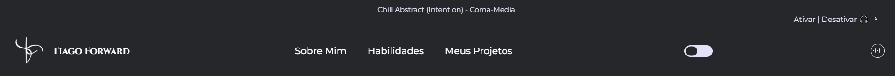

# Projeto Pessoal | Meu Portfolio

## Tabela do Conteudos

   * [Sobre](#sobre)
   * [Apresentação do portfólio](#apresentação)
      * [Cabeçalho](#cabeçalho)
      * [Perfil](#perfil)
      * [Sobre Mim](#sobre-mim)
      * [Habilidades](#habilidades)
      * [Projetos](#projetos)
      * [Rodapé](#rodapé)
   * [Versão Mobile e Modo Dark](#versão-mobile-e-modo-dark)
   * [Objetivo](#objetivo)
   * [Tecnologias](#tecnologias)
   * [Acessando o site](#acessando-o-site)

## Sobre

## Apresentação

- ### Cabeçalho

> Meu cabeçalho é composto por uma logo criada por mim mesmo, meu menu de habilidades ao ser clicado, direciona de forma suave para cada sessão do meu portfolio, também foi adicionado um botão para o modo dark, foi acrescentado outro botão para música, podendo tornar a experiência de navegação mais confortavél e agradavél, por último ao ser clicado nesse botão o nome da música acima terá uma animação de movimentação sutíl.

- ### Perfil

> Meu perfil é simples, contendo apenas uma mensagem de apresentação, foto de perfil, e links direcinados as redes, contatos e ao arquivo em pdf do meu currículo.

- ### Sobre mim

> Aqui temos uma breve apresentação sobre mim sem nenhum efeito.

- ### Habilidades

> Nas minhas habilidades segue uma animação ao passar o mouse por cima alterando sua escala e cor de icone.

- ### Projetos

> Na minha sessão de projetos, está exibindo o título do projeto e abaixo sua origem, também foi acrescentado algumas animações de clicks nos botões, e ao passar o cursor por cima do projeto ou clicando na versão mobile, sera exibido um mini resumo do projeto!

- ### Rodapé

> No meu rodapé, estou deixando mais alguns pequenos parágrafos, sugerindo para entrar em contato, um formulário para envio de observações e feedbacks e a descrição de Copyright ©.

- ### Versão Mobile e Modo Dark

> Tudo foi pensado de forma responsiva, para que se encaixe em todas as versões de dispositivos, como celulares, tablets, monitores e TVs. O modo dark foi criado para que o usuário pudesse navegar no site de forma mais suave, sem muita claridade.

##

## Objetivo

Com base nos conceitos adquiridos no curso Dev Quest, meu objetivo nesse meu primeiro projeto era colocar em prática todo meu conhecimento adquirido e poder está vencendo o desafio sugerido do curso com premiações aos vencedores, com intuito de que pudéssemos avançar ainda mais nosso conhecimento sendo mais incentivados. 

## Tecnologias

<ul>
<li>HTML</li>
<li>CSS</li>
<li>JavaScript</li>
<li>GIT BASH</li>
</ul>

## Acessando o site

Para acessar meu portfolio, por favor use esse link : <a href="https://tiago-forward.github.io/my-portfolio/" target="_blank">Projeto Pessoal | Meu portfolio</a>