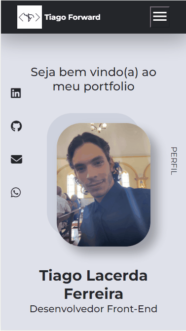

# Projeto Pessoal | Meu Portfolio

## Tabela do Conteudo

<ul>
<li><a href="#sobre">Sobre</a></li>
<li><a href="#status">Status</a></li>
<li><a href="#objetivo">Objetivo</a></li>
<li><a href="#curiosidade">Curiosidade</a></li>
<li><a href="#tecnologias">Tecnologias</a></li>
<li><a href="#acessando-o-site">Acessando o site</a></li>
</ul>

## Sobre

### Layout Desktop | Mobile.

## Status

Em desenvolvimento! 👌

## Objetivo

Com base nos conceitos adquiridos no curso Dev Quest, meu objetivo nesse meu primeiro projeto era colocar em prática todo meu conhecimento adquirido. Para um desafior ainda maior, optei por utilizar o método do 'display grid' como layout de todo o meu site.

## Curiosidade

Esse desafio permitiu-me ampliar meu conhecimento implementando novos conceitos de estilizações, como por exemplo a borda dinâmica no menu, a aplicação do efeito zoom ao passar o mouse sobre o elemento e a troca de imagens no menu responsivo com o JavaScript.

## Tecnologias

<ul>
<li>HTML</li>
<li>CSS</li>
<li>JavaScript</li>
<li>GIT BASH</li>
</ul>

## Acessando o site

Para acessar meu portfolio, por favor use esse link : <a href="https://tiago-forward.github.io/my-portfolio/" target="_blank">Projeto Pessoal | Meu portfolio</a>